# Memory-Game
## Table of Contents
1. [UX](#ux)
   - [Project Goals](#project-goals)
   - [User Stories](#user-stories)
   - [Design Choices](#design-choices)
   - [Wireframes](#wireframes)
2. [Features](#features)
   - [Existing Features](#existing-features)
   - [Features Left to Implement](#features-left-to-implement)
3. [Technologies Used](#technologies-used)
4. [Testing](#testing)
   - [Bugs Discovered ](#bugs-discovered)
   - [Solved Issues](#solved-issues)
5. [Deployment](#deployment)
   - [How to Run This Project Locally](#how-to-run-this-project-locally)
6. [Credits](#credits)
   - [Content and code ](#content-and-code) 
   - [Acknowledgement](#acknowledgement)

---
## UX
### Project Goals
This project aims to build an interactive front-end website using HTML, CSS, and JavaScript.  
I have decided to build a Memory Game that allows users to enjoy a fun and challenging pattern-matching experience. I have used the knowledge I've learned in the course to date, as well as good user experience principles, to create a responsive, well-designed, and functional game.

My web page consists of:  
- A landing page that introduces the game, explains the rules, and includes a "Restart Game" button.  
- The game board, which displays a grid of cards that the player can click to flip and match.  
- Feedback messages that indicate matches, mismatches, and game completion.  
- A restart button that allows the user to play again at any time.  
- A responsive design that works on mobile, tablet, and desktop screens.  

### User Stories

#### New Visitor
- As a new user, I would like to know how to play the Memory Game upon opening the site.  
- As a new user, I would like to see the game rules clearly explained.  
- As a new user, I would like to start the game easily with a single click.  
- As a new user, I would like the game to provide visual feedback when I flip cards.  
- As a new user, I would like to see a responsive layout that works on mobile, tablet, and desktop.  

#### Repeat User
- As a repeat user, I would like to imporve my time fo finish the game.  
- As a repeat user, I would like to be able to restart the game quickly.  
- As a repeat user, I would like to track my matches and see which pairs I have already found.  
- As a repeat user, I would like to see a message when I complete the game.  

#### Regular User
- As a regular user, I would like the game to provide a fun and challenging experience.    
- As a regular user, I would like the interface to be visually appealing and interactive.  

#### Game Owner / Developer
- As the developer, I want users to have a seamless and bug-free experience.  
- As the developer, I want users to understand the rules clearly.  
- As the developer, I want the game to work on all screen sizes and devices.  
- As the developer, I want to be able to easily maintain and extend the game with new features.

### Design Choices
#### Colour Scheme
- **Background:** `linear-gradient(135deg, #2c3e50, #1a2530)` (dark gradient backdrop)  
- **Primary Accent:** `#4caf50` (green — used on flipped cards, buttons, header highlights)  
- **Card Default:** `#ddd` (light grey for card backs)  
- **Text:** `#ffffff` (white on dark backgrounds, dark on light cards)  
- **Hover Button:** `#45a049` (darker green shade for button hover)

These colours give the game a **clean and vibrant look** while keeping it accessible and readable.

---

#### Typography
- **Font Family:** `Arial, sans-serif` for general layout  
- **Fallback:** `Segoe UI`, `Tahoma`, `Verdana` and other web-safe sans-serif fonts  
- This ensures **readability and consistency** across different devices.

---

#### Layout & Responsiveness
- **Grid Layout:** The board uses CSS Grid to create a 4x4 layout of 100x100px cards.
- **Responsive Media Queries:**  
  - Under 414px: buttons, controls, and score areas resize and stack for mobile.  
  - Under 320px: further scaling down of the game area for very small screens.

#### Home page screenshot 

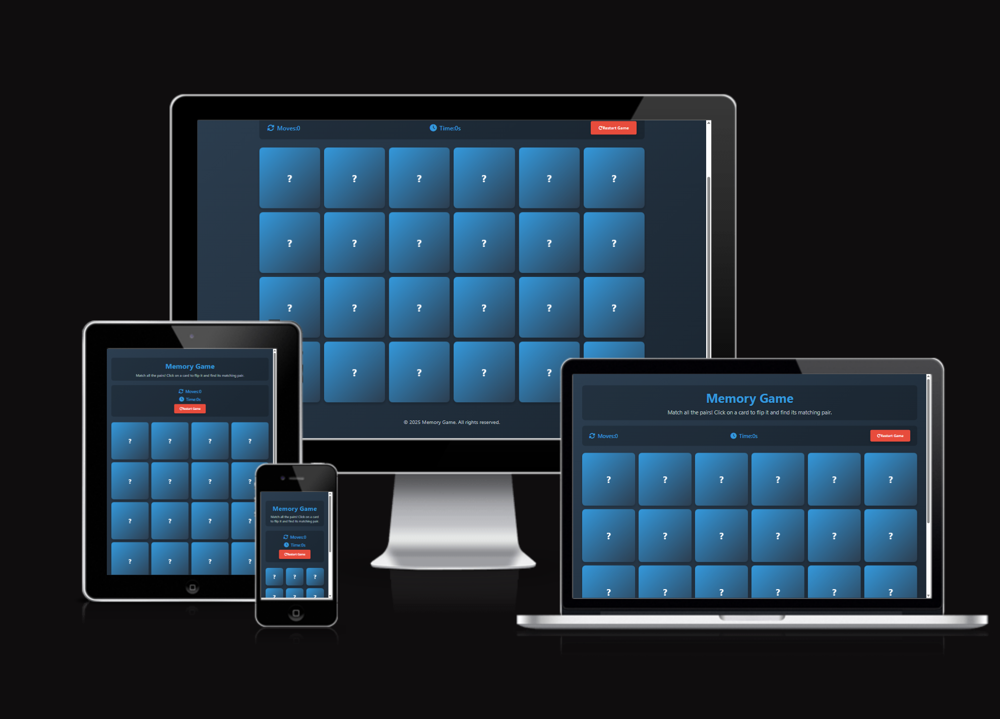

- screenshots created using [Am I responsive](http://ami.responsivedesign.is/)

#### Icons

For the memory card icons, I used built-in Unicode emoji characters rather than external image files.  
These emojis are supported natively by all modern browsers and operating systems, so they do not require any additional image hosting or licensing.

['🍎','🍌','🍇','🍒','🍓','🍑','🍍','🥝'];

---

### Wireframes

I've created Wireframes to plan the layout and design of the Memory Game.  
Below are the pages and versions for different devices. 

#### Game Board / Play Area
- **Desktop:** [Link to PDF](assets/wireframes/Milestone-project-2-desktop.pdf)  
- **Tablet:** [Link to PDF](assets/wireframes/Milestone-project-2-Ipad%20.pdf)  
- **Mobile:** [Link to PDF](assets/wireframes/milestone-project-2-mobile%20.pdf)  

---

## Features

### Existing Features
- **Header Section:** Displays the game title.
- **Game Board:** A grid of hidden cards (4x4 layout) that can be flipped to reveal icons.
- **Matching Logic:** Flipped cards stay revealed if they match.
- **Restart Button:** Allows players to restart the game at any time.
- **Responsive Design:** Adapts to desktop, tablet, and mobile screen sizes.

### Features Left to Implement
- High score storage using localStorage.
- Difficulty levels (more cards).

---

## Technologies Used
- **HTML5** — for structure and content  
- **CSS3** — for styling and responsive design  
- **JavaScript** — for game logic and interactivity 
- **Balsamiq** - used to create Wireframes for the project during the initial planning stage. 
- **Git hub** - Github was used to create and store the project repository.

---

## Testing

### User Stories Testing

#### **New Visitor Stories**

 **1. As a new user, I would like to know how to play the Memory Game upon opening the site**
- **Expected:** Clear instructions visible immediately when page loads  
- **Testing:** Opened the application and checked for visible instructions  
- **Result:** Instructions displayed below game title:  
  *"Match all the pairs! Click on a card to flip it and find its matching pair"*  
- **Fix:** None required  

           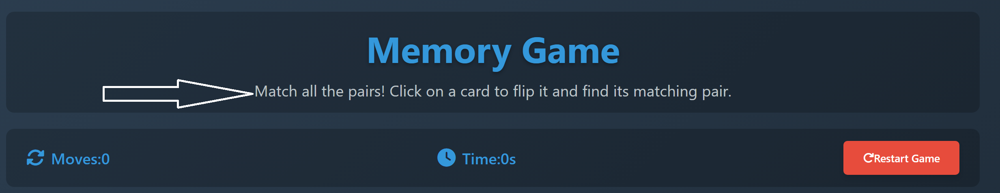
         

**2. As a new user, I would like to see the game rules clearly explained**
- **Expected:** Simple, understandable gameplay rules  
- **Testing:** Read the instruction text for clarity and completeness  
- **Result:** Rules are concise and explain the core gameplay mechanic  
- **Fix:** None required  

**3. As a new user, I would like to start the game easily with a single click**
- **Expected:** Game should begin without complex setup  
- **Testing:** Clicked first card to begin gameplay  
- **Result:** Game started immediately with timer activation  
- **Fix:** None required  

           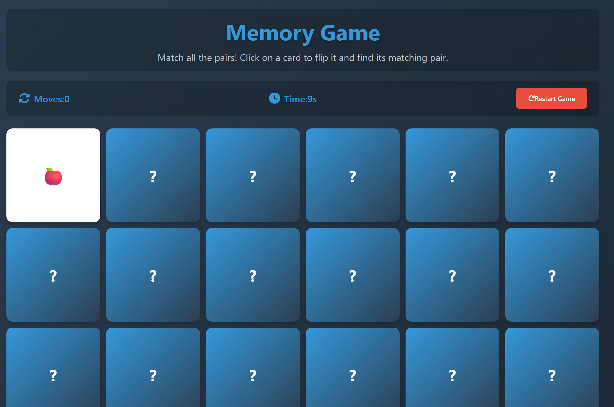
         

**4. As a new user, I would like the game to provide visual feedback when I flip cards**
- **Expected:** Clear visual changes during card interactions  
- **Testing:** Clicked multiple cards and monitored animation  
- **Result:** Cards flip with smooth animation and change appearance when matched  
- **Fix:** None required  

           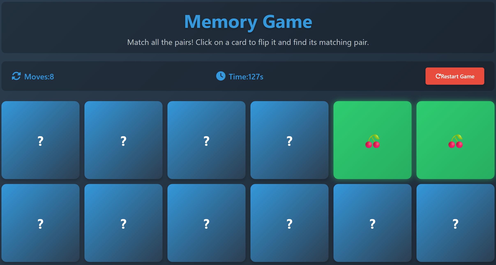
         

**5. As a new user, I would like to see a responsive layout on mobile, tablet, and desktop**
- **Expected:** Layout should adapt to all screen sizes  
- **Testing:** Tested using browser dev tools  
- **Result:** Grid switches from 4 columns to 3 columns on small screens  
- **Fix:** None required  

           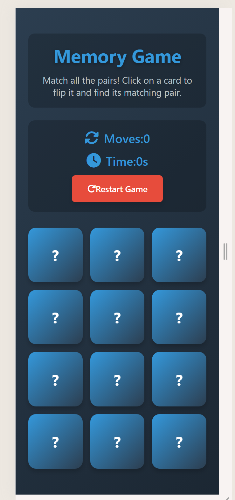
         

---

#### **Repeat User Stories**

 **1. As a repeat user, I want to improve my time completion**
- **Expected:** Ability to track times and beat personal bests  
- **Testing:** Played multiple sessions and compared times  
- **Result:** Timer provides clear and accurate time tracking  
- **Fix:** None required  

           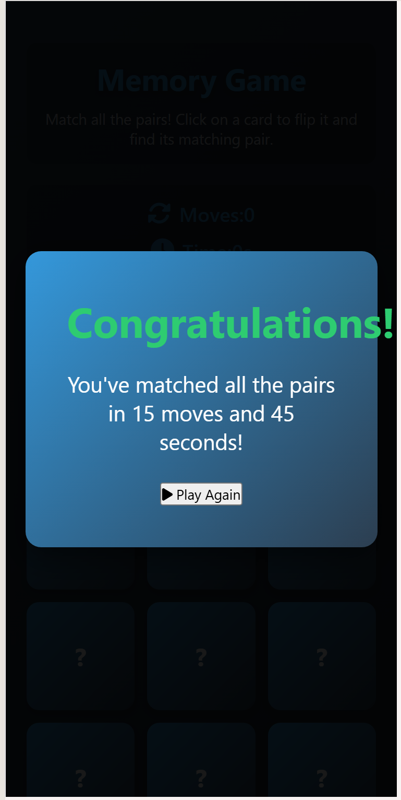
         

 **2. As a repeat user, I want to quickly restart the game**
- **Expected:** Single-click restart functionality  
- **Testing:** Pressed restart button during gameplay  
- **Result:** Game resets instantly with a fresh shuffle  
- **Fix:** None required  

           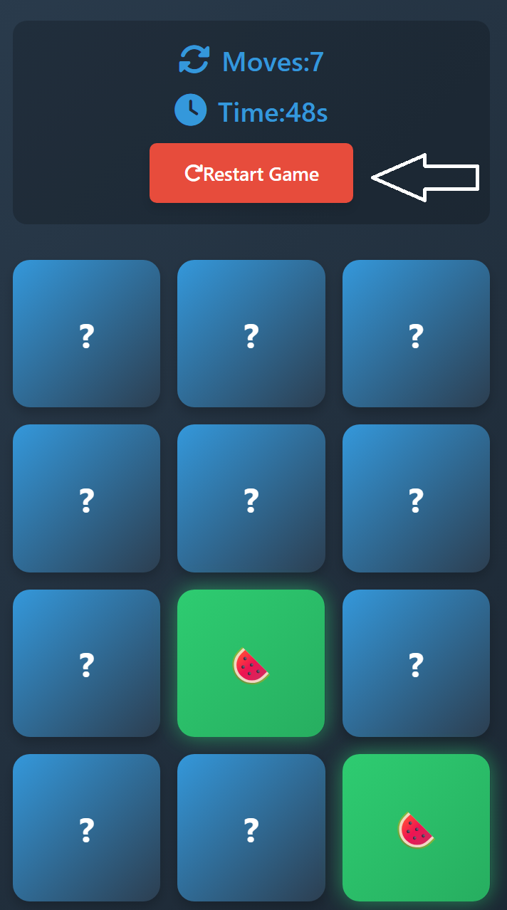
         

 **3. As a repeat user, I want to track my matches visually**
- **Expected:** Matched cards stay revealed  
- **Testing:** Matched several pairs  
- **Result:** Matched cards remain visible with distinct green color  
- **Fix:** None required  

           
         

 **4. As a repeat user, I want a message when I complete the game**
- **Expected:** Win notification  
- **Testing:** Completed all pairs  
- **Result:** Win message appears showing final moves and time  
- **Fix:** None required  

           
         

---

#### **Regular User Stories**

**1. As a regular user, I want the game to be fun and challenging**
- **Expected:** Engaging replayable gameplay  
- **Testing:** Played multiple rounds  
- **Result:** Random shuffle increases replayability and memory challenge  
- **Fix:** None required  

 **2. As a regular user, I want an appealing, interactive interface**
- **Expected:** Visually pleasing UI with smooth interactions  
- **Testing:** Reviewed design, animations, and user flow  
- **Result:** Clean visuals with smooth flip animations  
- **Fix:** None required  

---

#### **Game Owner / Developer Stories**

**1. As the developer, I want users to have a seamless and bug-free experience**
- **Expected:** No crashes or broken features  
- **Testing:** Performed full test on interactions and logic  
- **Result:** All features functioning correctly  
- **Fix:** None required  

**2. As the developer, I want users to clearly understand the rules**
- **Expected:** Instructions must be easy to read and find  
- **Testing:** Reviewed visibility and clarity  
- **Result:** Instructions are prominently displayed and understandable  
- **Fix:** None required  

**3. As the developer, I want the game to work on all screen sizes**
- **Expected:** Fully responsive layout  
- **Testing:** Tested on multiple screens and browsers  
- **Result:** Responsive behavior works correctly  
- **Fix:** None required  

**4. As the developer, I want the code to be easy to maintain and expand**
- **Expected:** Clean, modular code  
- **Testing:** Reviewed JavaScript structure  
- **Result:** Functions are organized with clear separation of logic  
- **Fix:** None required  

### Manual Testing of Game Elements
#### **Card Flip Functionality**
- **Expected:** Clicking a card flips it to reveal the symbol with smooth animation  
- **Testing:** Clicked multiple cards in succession and observed animation  
- **Result:** Cards flipped correctly with smooth transition  
- **Fix:** None required  

#### **Card Matching Logic**
- **Expected:** Two identical cards should stay flipped; non-matching pairs should flip back after 1 second  
- **Testing:** Tested multiple matching and non-matching pairs  
- **Result:** Matching pairs remained visible; non-matching flipped back correctly  
- **Fix:** None required  

#### **Move Counter**
- **Expected:** Each pair attempt should increment the move counter by 1  
- **Testing:** Made multiple moves and verified counter updates  
- **Result:** Counter incremented accurately for each pair attempt  
- **Fix:** None required  

#### **Game Timer**
- **Expected:** Timer should start on the first card click and run until game completion  
- **Testing:** Started game and monitored timer progression  
- **Result:** Timer started correctly and ran without interruption  
- **Fix:** None required  

#### **Restart Button**
- **Expected:** Should reset game state, shuffle cards, and reset all counters  
- **Testing:** Clicked restart button during active gameplay  
- **Result:** Game reset completely with new card arrangement  
- **Fix:** None required  

#### **Win Condition**
- **Expected:** Game should end and display win message when all 8 pairs are matched  
- **Testing:** Systematically matched all pairs  
- **Result:** Win message displayed with correct move count and time  
- **Fix:** None required  

#### **Play Again Button**
- **Expected:** Should restart game and hide win message after victory  
- **Testing:** Clicked play again button after winning  
- **Result:** Game reset properly and win message was hidden  
- **Fix:** None required  

---

### Double-Click Guard Test

- **Expected:** Clicking the same card twice should not count as a move or break the game  
- **Testing:** Clicked same card twice rapidly and monitored behavior  
- **Result:** No move counted; gameplay continued normally  
- **Fix:** None required  

---

### Responsiveness Testing

- **Desktop (1200px+):** 6-column grid displayed perfectly  
- **Tablet (768px):** 4-column grid maintained good layout  
- **Mobile (375px):** Adjusted to a 3-column grid 

---

### Code Validation

- **HTML Validation:** Passed — no errors using W3C Validator  

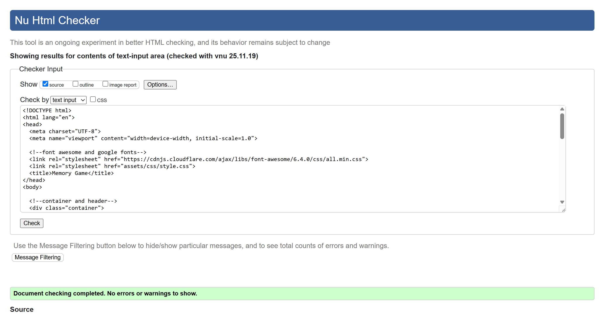

- **CSS Validation:** Passed — no errors using W3C CSS Validator  

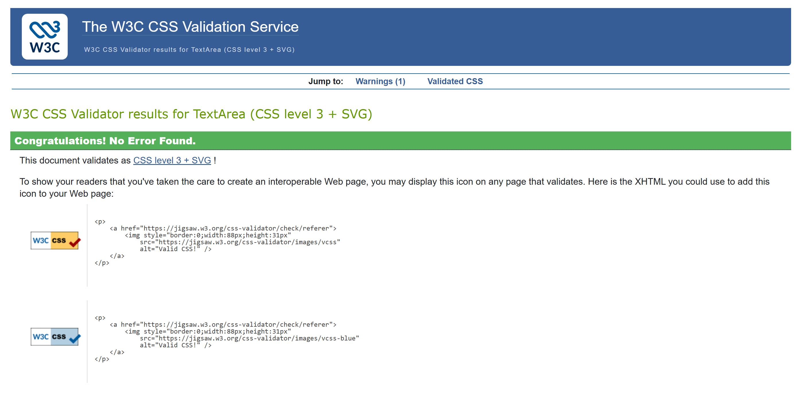

- **JavaScript Validation:** Passed — no critical errors using JSHint  

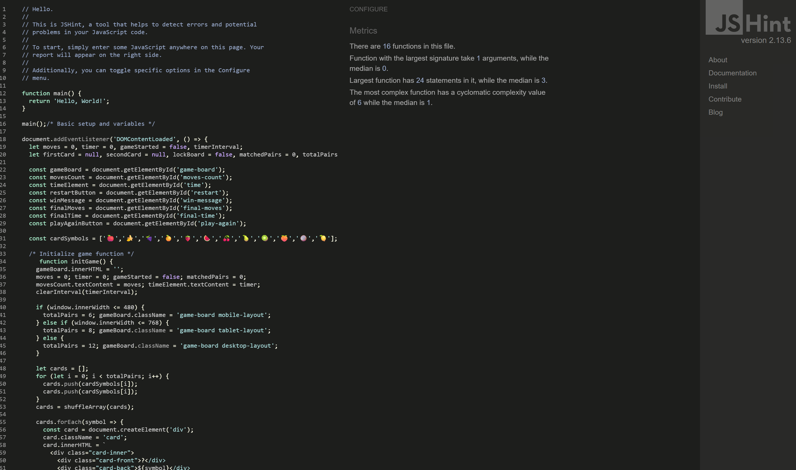

---

### Bug Documentation

#### **Resolved Bugs**

**1. Card Matching Logic Issue**  
- **Problem:** Incorrect card comparisons  
- **Root Cause:** Compared DOM elements instead of data values  
- **Fix:** Updated to use `dataset.value`  
- **Status:** ✅ Fixed  

**2. Timer Reset Issue**  
- **Problem:** Timer did not always clear on restart  
- **Root Cause:** Interval not cleared before creating new one  
- **Fix:** Added `clearInterval()` before starting timer  
- **Status:** ✅ Fixed  

#### **Open Bugs**
- None identified  

---

### Feature Testing

- **Card Shuffle:** Cards shuffled into new arrangement each game  
- **Game State Reset:** Complete reset on restart  
- **Win Condition:** Correct detection when all pairs matched  
- **Mobile Layout:** Responsive across screen sizes  

---

### Browser Compatibility

- **Chrome 90+:** ✅ Fully functional  
- **Firefox 88+:** ✅ Fully functional  
- **Safari 14+:** ✅ Fully functional  
- **Edge 90+:** ✅ Fully functional  

---

### Screenshots

- **Main Game Interface:** Board with cards, counters, and controls  
- **Win Message:** Victory popup with statistics  
- **Mobile View:** Responsive layout  

---
**Bug Discovered**
- Modal opacity issues on small screens  
**Fix:** Adjusted CSS to properly overlay modals and center content.

## Deployment

**Step 1: Sign in to GitHub**  
I first signed into GitHub to access repositories.
**Step 2: Locate the Template**  
I navigated to the repository.
-

           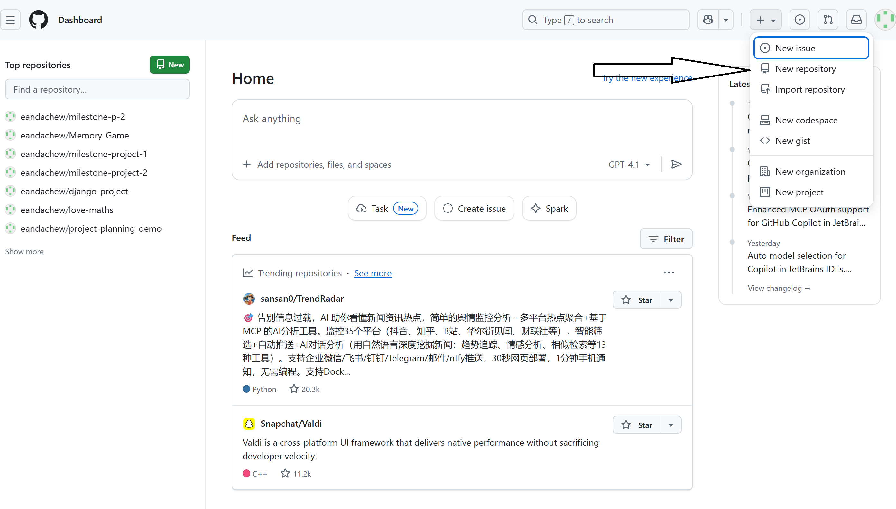
         

**Step 3: Use the Template**  
I clicked the "Use this template" button.   
**Step 4: Name the Repository**  
I named the new repository **Memory-Game** and created it.  
-

           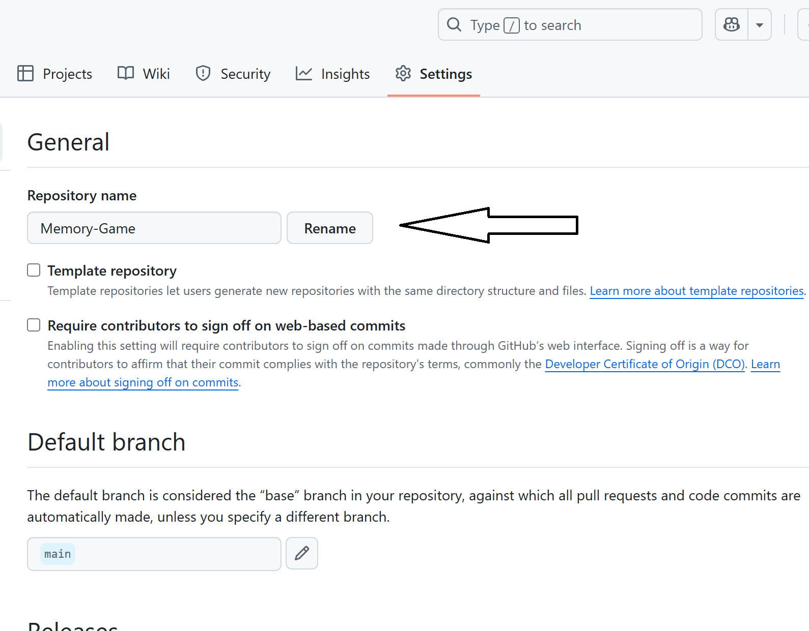
         

**Step 5: Add, Commit, and Push Files**
- Once all files were created, I added, committed, and pushed them to GitHub:

git add .
git commit -m "Initial commit"
git push origin main

**Stepv 6: Git Workflow During Development**

Throughout the project, I used **Git** to save and store progress:

- git add . → to stage changes  
- git commit -m "Message" → to commit changes  
- git push origin main → to push changes to GitHub  

**Step 7: Deploy to GitHub Pages**

1. Open the project repository on GitHub.  
2. Go to **Settings**.   
-

           
         

3. Scroll down to the **GitHub Pages** section.  
-

           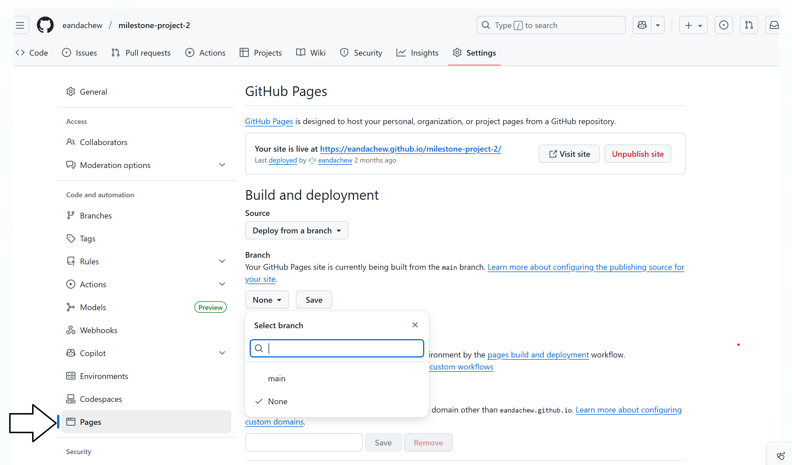
         

4. Under **Source**, select the **Main Branch**.
-

           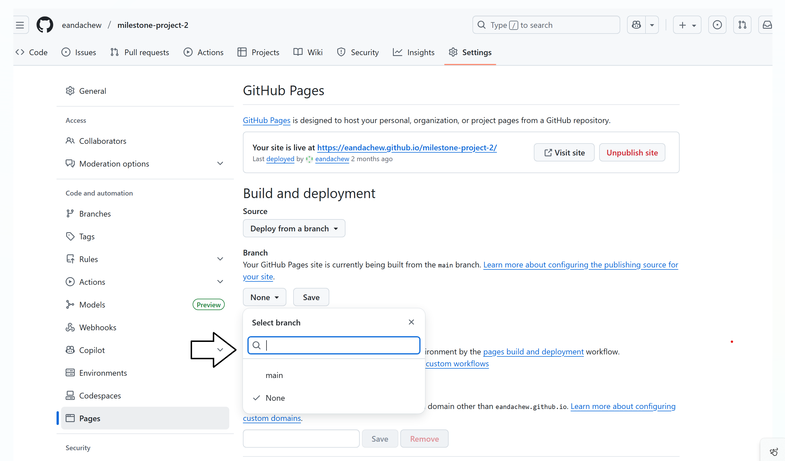
         
  
5. The page refreshes and a link to the live site appears.
-

           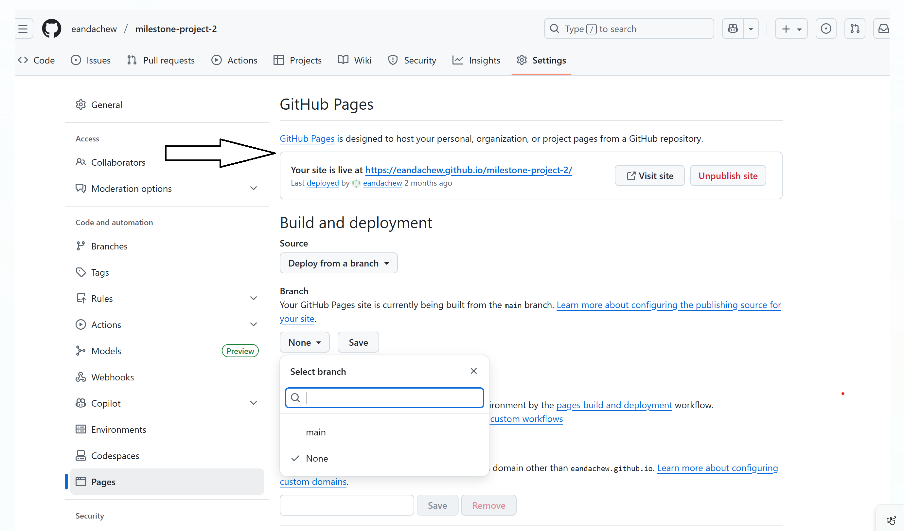
         

**Deployment Issue**
At first, the deployment did not work because GitHub created an extra folder inside the repository.  
That folder contained the `assets/`, `index.html`, and `README.md` instead of placing them in the root of the repository.  
Since GitHub Pages only looks for `index.html` in the **root** (or `/docs` if configured), the site returned a 404 error.

**Fix**
- Deleted the unnecessary inner folder.  
- Moved `assets/`, `index.html`, and `README.md` to the root of the repository.  
- Re-deployed from the `main` branch, root folder.  

**Deployed Site**
The live site can be viewed here:  
👉 [Project Link](https://eandachew.github.io/Memory-Game/)
- 

### How to Run This Project Locally
1. repository.
2. Open index.html in your browser or run a local server.

---

## Credits

### Content and code 
- Game logic written by me using HTML, CSS, and JavaScript.
### Acknowledgement

- Code Institute for getting me to this point
